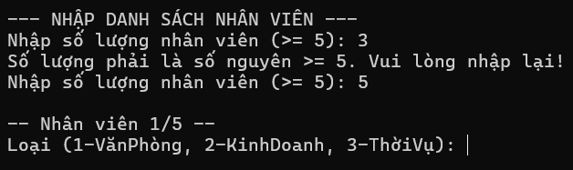
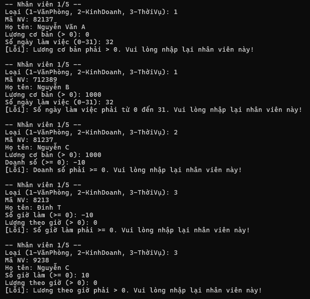
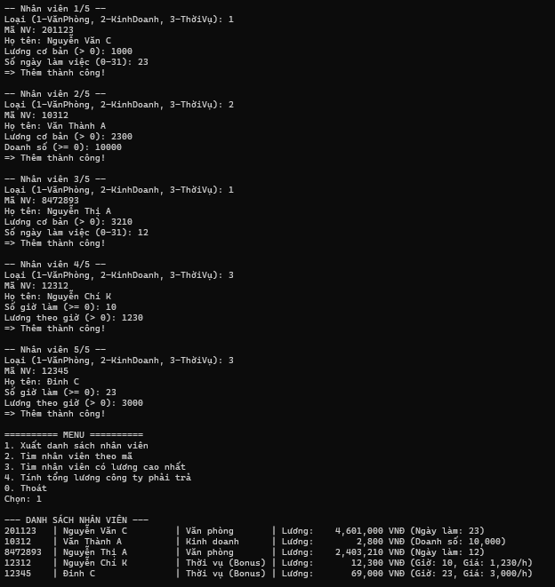
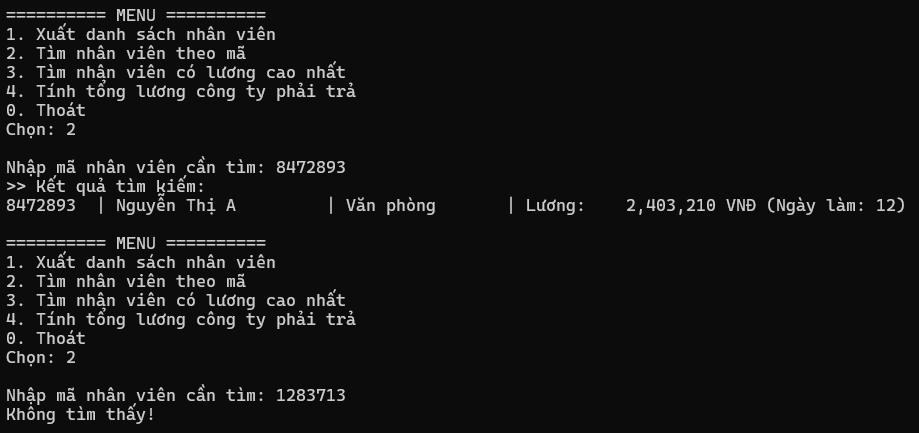
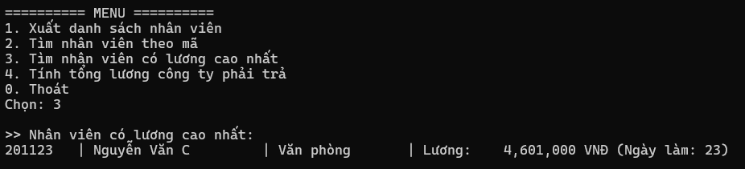
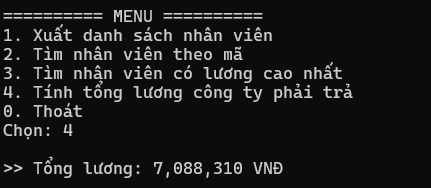
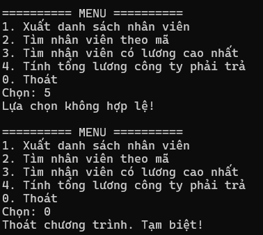

# BÁO CÁO KẾT QUẢ BÀI TẬP TRÊN LỚP – QUẢN LÝ NHÂN VIÊN
**Học phần:** COMP1019 - Lập trình trên Windows  
**Sinh viên thực hiện:** Đặng Hoàng Bảo Huy | **MSSV:** 51.01.104.033 | **Lớp:** 51.01.CNTT.C  

---

## 1. Khởi động và Nhập danh sách nhân viên

- **Mô tả:** Khi khởi động, chương trình yêu cầu nhập số lượng nhân viên (bắt buộc $N \ge 5$). Cho phép chọn và nhập lần lượt 3 loại nhân viên:
  - **1 - Văn phòng:** Nhập mã, họ tên, lương cơ bản ($> 0$), số ngày làm việc ($0 - 31$).
  - **2 - Kinh doanh:** Nhập mã, họ tên, lương cơ bản ($> 0$), doanh số ($\ge 0$).
  - **3 - Thời vụ:** Nhập mã, họ tên, số giờ làm ($\ge 0$), lương theo giờ ($> 0$).

---

## 2. Kiểm tra dữ liệu đầu vào & Bắt lỗi (Validation & Try-Catch)

- **Mô tả:** Chương trình kiểm soát dữ liệu đầu vào chặt chẽ thông qua tính đóng gói và xử lý ngoại lệ:
  - Khi nhập sai (lương cơ bản $\le 0$, số ngày làm ngoài khoảng $0 - 31$, doanh số âm, số giờ làm âm, lương giờ $\le 0$, hoặc sai định dạng số), các setter sẽ ném `throw new Exception(...)`.
  - Khối `try-catch` trong `NhapDanhSach()` bắt lỗi, in thông báo cụ thể từ `ex.Message` và cho phép người dùng nhập lại thông tin nhân viên đó mà không bị crash ứng dụng.

---

## 3. Xuất danh sách nhân viên (Chức năng 1)

- **Mô tả:** Chọn **1** trên menu, chương trình duyệt danh sách và gọi phương thức đa hình `HienThiThongTin()`. Tự động áp dụng định dạng và tính lương chính xác theo từng loại nhân viên mà không dùng câu lệnh `if/switch` kiểm tra kiểu.

---

## 4. Tìm kiếm nhân viên theo mã (Chức năng 2)

- **Mô tả:** Chọn **2** và nhập mã nhân viên cần tìm kiếm (so khớp không phân biệt hoa thường):
  - **Tìm thấy:** Gọi phương thức `HienThiThongTin()` hiển thị đầy đủ thông tin nhân viên.
  - **Không tìm thấy:** In ra thông báo *"Không tìm thấy!"*.

---

## 5. Tìm nhân viên có lương cao nhất (Chức năng 3)

- **Mô tả:** Chọn **3**, chương trình duyệt danh sách và so sánh thu nhập qua phương thức đa hình `TinhLuong()`. Tìm và hiển thị chi tiết nhân viên có mức lương thực nhận cao nhất.

---

## 6. Tính tổng lương công ty phải trả (Chức năng 4)

- **Mô tả:** Chọn **4**, chương trình tính tổng quỹ lương bằng cách cộng dồn `nv.TinhLuong()` của toàn bộ nhân viên và hiển thị kết quả có định dạng phân cách hàng nghìn (`N0 VNĐ`).

---

## 7. Thoát chương trình (Chức năng 0) và Lựa chọn không hợp lệ

- **Mô tả:**
  - Chọn **0**, chương trình xuất thông báo *"Thoát chương trình. Tạm biệt!"* và kết thúc ứng dụng an toàn.
  - Chọn ngoài menu, chương trình in ra *"Lựa chọn không hợp lệ. Vui lòng chọn lại!"* và cho phép nhập lại.
