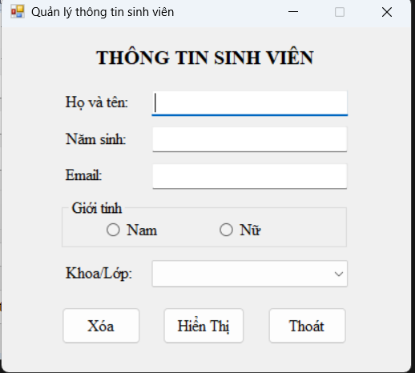
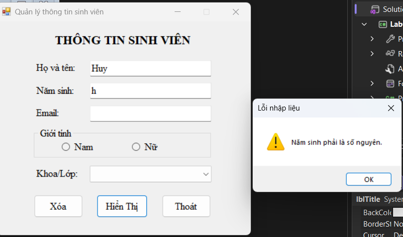
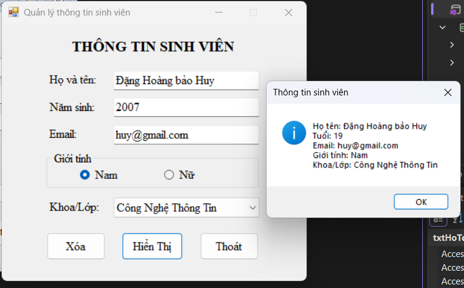
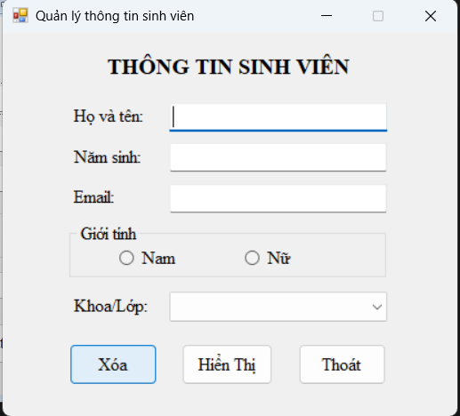
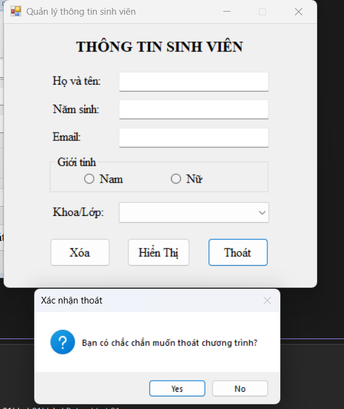

# BÁO CÁO KẾT QUẢ THỰC HÀNH LAB 01
**Học phần:** COMP1019 - Lập trình trên Windows  
**Sinh viên thực hiện:** Đặng Hoàng Bảo Huy | **MSSV:** 51.01.104.033 | **Lớp:** 51.01.CNTT.C  

---

## 1. Giao diện khởi động ban đầu

- **Mô tả:** Khi vừa chạy ứng dụng, Form tự động hiển thị giữa màn hình (`CenterScreen`). Các ô TextBox trống, 2 RadioButton chưa tích chọn và ComboBox đã nạp sẵn 3 chuyên ngành nhưng ở trạng thái chưa chọn (`SelectedIndex = -1`).

---

## 2. Kiểm tra dữ liệu đầu vào (Validation)

- **Mô tả:** Bấm **Hiển thị** khi dữ liệu bị trống hoặc sai định dạng. Chương trình sẽ cảnh báo bằng hộp thoại `MessageBox` và tự động focus con trỏ chuột về ô cần sửa:
  - Bắt lỗi để trống: Họ tên, Năm sinh, Email, Giới tính, Khoa/Lớp.
  - Bắt lỗi Năm sinh: Phải là số nguyên và nằm trong khoảng từ `1900` đến năm hiện tại.

---

## 3. Hiển thị thông tin sinh viên thành công

- **Mô tả:** Khi toàn bộ dữ liệu hợp lệ, chương trình tính tuổi tự động (`Tuổi = Năm hiện tại - Năm sinh`) và hiển thị kết quả tổng hợp qua hộp thoại `MessageBox` đầy đủ các thông tin: Họ tên, Tuổi, Email, Giới tính, Khoa/Lớp.

---

## 4. Chức năng nút Xóa (Reset)

- **Mô tả:** Bấm **Xóa** sẽ đưa tất cả ô TextBox về rỗng, bỏ tích chọn RadioButton Nam/Nữ, đưa ComboBox về trạng thái chưa chọn và đưa con trỏ chuột về ô Họ tên để nhập lại từ đầu.

---

## 5. Xác nhận thoát ứng dụng (Nút Thoát)

- **Mô tả:** Bấm **Thoát**, chương trình hiển thị hộp thoại xác nhận `Yes/No` (`MessageBoxButtons.YesNo`):
  - Bấm **No**: Giữ nguyên chương trình đang chạy.
  - Bấm **Yes**: Đóng ứng dụng an toàn (`Application.Exit()`).
