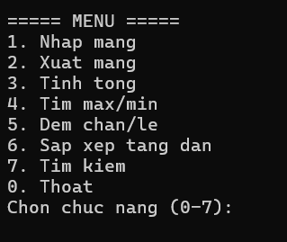
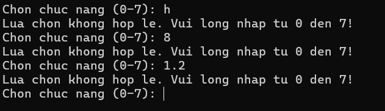
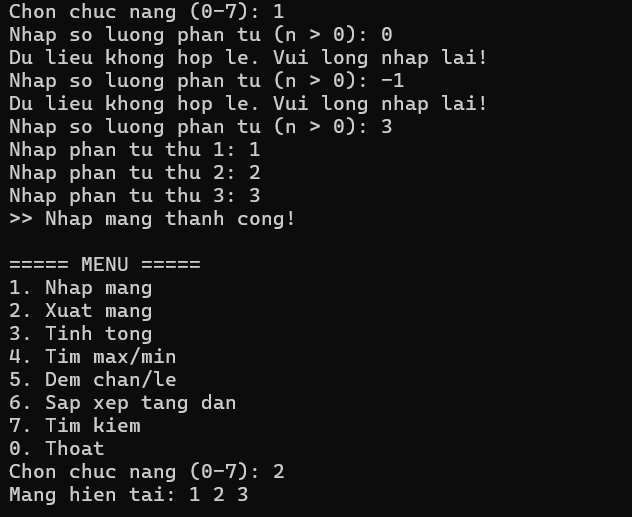
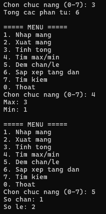
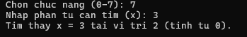
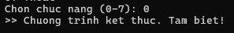

# BÁO CÁO KẾT QUẢ THỰC HÀNH LAB 02
**Học phần:** COMP1019 - Lập trình trên Windows  
**Sinh viên thực hiện:** Đặng Hoàng Bảo Huy | **MSSV:** 51.01.104.033 | **Lớp:** 51.01.CNTT.C  

---

## 1. Giao diện Menu điều khiển ban đầu

- **Mô tả:** Khi khởi động ứng dụng Console, chương trình hiển thị menu 8 lựa chọn (từ 0 đến 7). Con trỏ mảng ban đầu được gán giá trị `null` và chờ người dùng chọn chức năng.
- **Tính năng:**
  - Thiết lập font Tiếng Việt chuẩn UTF-8 (`Console.OutputEncoding = Encoding.UTF8`).
  - Lặp vô tận cho đến khi người dùng chọn phím `0` để thoát.

---

## 2. Kiểm tra dữ liệu đầu vào & Bắt lỗi (Validation)

- **Mô tả:** Chương trình kiểm soát chặt chẽ toàn bộ các luồng nhập liệu nhằm tránh văng lỗi (*runtime crash*):
  - **Bắt lỗi chọn chức năng:** Bắt buộc nhập số nguyên từ `0` đến `7`. Nếu nhập chữ hoặc số ngoài khoảng, chương trình thông báo *"Lua chon khong hop le. Vui long nhap tu 0 den 7!"*.
  - **Kiểm tra khởi tạo mảng:** Nếu người dùng chưa chọn `1` (chưa nhập mảng) mà chọn các chức năng `2, 3, 4, 5, 6, 7`, chương trình phát hiện `a == null` và nhắc nhở: *">> Ban chua nhap mang! Vui long chon chuc nang 1 de nhap mang."*.
  - **Bắt lỗi số lượng phần tử $n$:** Số lượng phần tử mảng phải là số nguyên dương ($n > 0$). Nếu nhập $n \le 0$ hoặc ký tự chữ cái, chương trình yêu cầu nhập lại ngay lập tức.
  - **Bắt lỗi từng phần tử mảng:** Dùng `int.TryParse` để chặn các giá trị không phải số nguyên.

---

## 3. Chức năng Nhập và Xuất mảng số nguyên (Chức năng 1 & 2)

- **Mô tả:**
  - **Chức năng 1 (Nhập mảng):** Khởi tạo mảng động `new int[n]` với kích thước $n$ đã xác thực, cho phép nhập từng phần tử từ bàn phím và gán tham chiếu vào biến `a`.
  - **Chức năng 2 (Xuất mảng):** Duyệt qua mảng bằng vòng lặp và in danh sách các phần tử cách nhau bởi dấu khoảng trắng trên cùng một dòng.

---

## 4. Chức năng Thống kê & Tính toán (Chức năng 3, 4, 5)

- **Mô tả:**
  - **Chức năng 3 (Tính tổng):** Hàm `TinhTong(int[] a)` tính tổng giá trị toàn bộ phần tử trong mảng (hỗ trợ cả số nguyên dương và số nguyên âm).
  - **Chức năng 4 (Tìm Max / Min):** Hai hàm `TimMax(int[] a)` và `TimMin(int[] a)` duyệt tuyến tính từ phần tử thứ 2 để tìm giá trị lớn nhất và nhỏ nhất.
  - **Chức năng 5 (Đếm số chẵn / lẻ):**
    - `DemChan(int[] a)`: Đếm các phần tử chia hết cho 2 (`x % 2 == 0`).
    - `DemLe(int[] a)`: Đếm các phần tử không chia hết cho 2 (`x % 2 != 0`, hoạt động chính xác với cả số nguyên âm lẻ như `-1, -3,...`).

---

## 5. Chức năng Sắp xếp mảng tăng dần (Chức năng 6)

- **Mô tả:**
  - Sử dụng thuật toán đổi chỗ trực tiếp (Interchange Sort) lồng 2 vòng lặp để hoán đổi các cặp phần tử $a[i] > a[j]$.
  - Sau khi sắp xếp, chương trình tự động gọi hàm `XuatMang(a)` để người dùng quan sát kết quả mảng đã được sắp xếp tăng dần.

---

## 6. Chức năng Tìm kiếm phần tử $x$ (Chức năng 7)

- **Mô tả:**
  - Cho phép người dùng nhập giá trị nguyên $x$ cần tìm.
  - Hàm `TimKiem(int[] a, int x)` duyệt tuyến tính tìm vị trí xuất hiện đầu tiên của $x$:
    - Nếu tìm thấy: In thông báo kèm vị trí chỉ mục (tính từ 0).
    - Nếu không tìm thấy: Trả về `-1` và thông báo *"Khong tim thay x trong mang"*.

---

## 7. Chức năng Thoát chương trình (Chức năng 0)

- **Mô tả:** Khi chọn chức năng `0`, vòng lặp `while (choice != 0)` kết thúc, in dòng thông báo *">> Chuong trinh ket thuc. Tam biet!"* và đóng ứng dụng an toàn.

