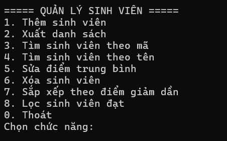
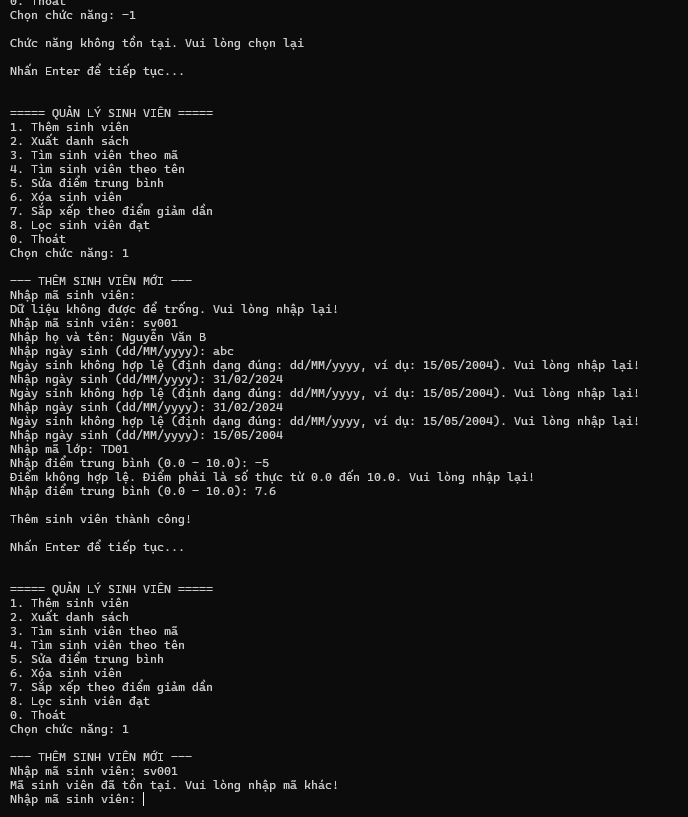
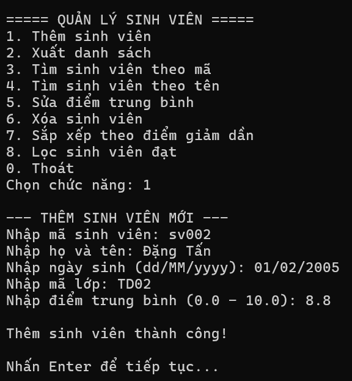
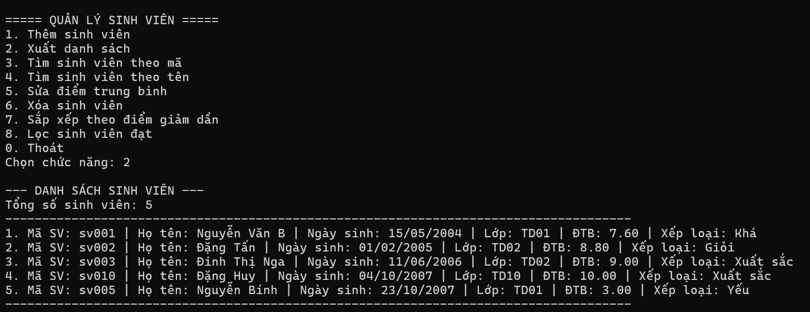
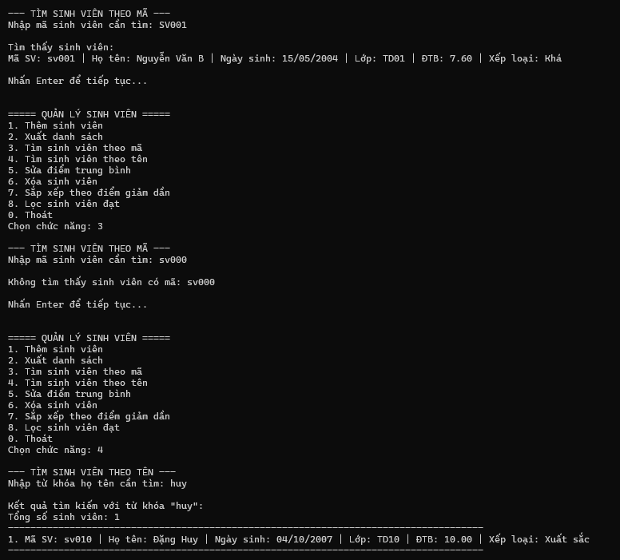
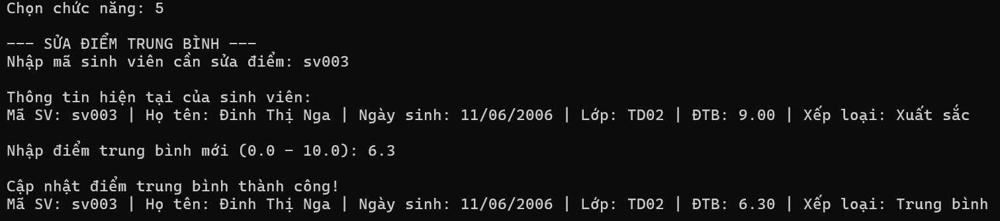
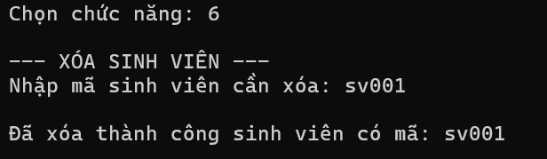
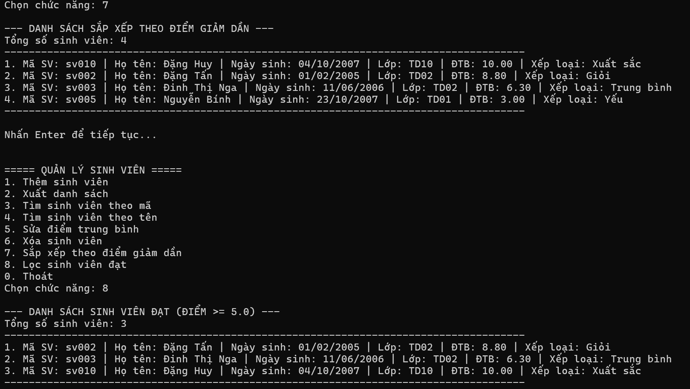
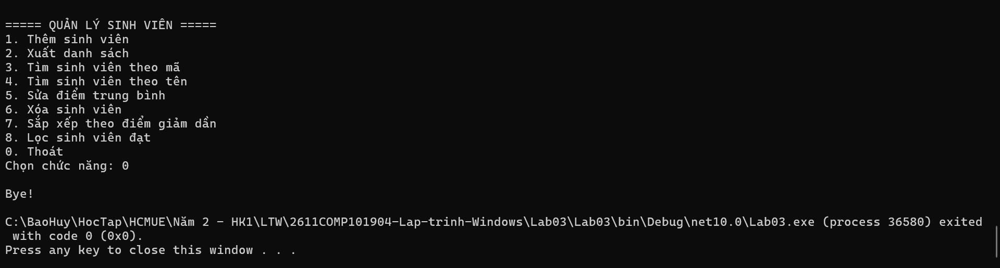

# BÁO CÁO KẾT QUẢ THỰC HÀNH LAB 03
**Học phần:** COMP1019 - Lập trình trên Windows  
**Sinh viên thực hiện:** Đặng Hoàng Bảo Huy | **MSSV:** 51.01.104.033 | **Lớp:** 51.01.CNTT.C  

---

## 1. Giao diện Menu điều khiển ban đầu

- **Mô tả:** Khi khởi động ứng dụng Console, chương trình hiển thị menu quản lý sinh viên với 9 lựa chọn (từ 0 đến 8) và con trỏ chờ người dùng nhập lệnh.
- **Tính năng:**
  - Hỗ trợ xuất/nhập tiếng Việt có dấu qua mã hóa UTF-8 (`Console.OutputEncoding = Encoding.UTF8`).
  - Sử dụng vòng lặp `do-while` duy trì chương trình cho đến khi người dùng nhập `0` để kết thúc.

---

## 2. Kiểm tra dữ liệu đầu vào & Bắt lỗi (Validation)

- **Mô tả:** Kiểm soát chặt chẽ luồng nhập liệu nhằm ngăn chặn hoàn toàn lỗi văng chương trình (*runtime crash*):
  - **Lỗi chọn chức năng:** Bắt buộc nhập số nguyên từ `0` đến `8`. Nhập chữ cái hoặc số ngoài khoảng sẽ thông báo *"Lựa chọn không hợp lệ. Vui lòng nhập số từ 0 - 8."*.
  - **Lỗi dữ liệu để trống:** Các trường thông tin (Mã SV, Họ tên, Mã lớp) nếu để trống hoặc chỉ chứa khoảng trắng sẽ bị yêu cầu nhập lại.
  - **Lỗi trùng mã sinh viên:** Kiểm tra mã đã tồn tại trong danh sách trước khi cho phép nhập các thông tin tiếp theo.
  - **Lỗi ngày sinh:** Kiểm tra nghiêm ngặt định dạng ngày/tháng/năm `dd/MM/yyyy` thông qua `DateTime.TryParseExact`.
  - **Lỗi điểm trung bình:** Chỉ chấp nhận số thực trong đoạn $[0.0, 10.0]$; cho phép nhập cả dấu phẩy (`,`) lẫn dấu chấm (`.`).

---

## 3. Chức năng Thêm sinh viên (Chức năng 1)

- **Mô tả:**
  - Nhập đầy đủ thông tin: Mã sinh viên, Họ tên, Ngày sinh, Mã lớp và Điểm trung bình.
  - Tạo đối tượng `SinhVien` (kế thừa từ `Nguoi`) và gọi phương thức `qlsv.Them(svMoi)`.
  - Xếp loại học lực được tính toán tự động dựa trên điểm trung bình ngay khi khởi tạo.

---

## 4. Chức năng Xuất danh sách sinh viên (Chức năng 2)

- **Mô tả:**
  - Duyệt qua `List<SinhVien>` và hiển thị tổng số lượng sinh viên hiện có.
  - In thông tin từng sinh viên thông qua hàm ghi đè `LayThongTin()`: Mã SV, Họ tên, Ngày sinh định dạng `dd/MM/yyyy`, Mã lớp, Điểm trung bình (làm tròn 2 chữ số thập phân) và Xếp loại học lực.
  - Nếu danh sách chưa có sinh viên nào, thông báo *"Danh sách trống"*.

---

## 5. Chức năng Tìm kiếm sinh viên (Chức năng 3 & 4)

- **Mô tả:**
  - **Chức năng 3 (Tìm theo mã):** Dùng LINQ `FirstOrDefault` tìm kiếm chính xác theo mã sinh viên (không phân biệt hoa/thường). Nếu tìm thấy sẽ in thông tin chi tiết; nếu không, thông báo *"Không tìm thấy sinh viên"*.
  - **Chức năng 4 (Tìm theo tên):** Dùng LINQ `Where` kết hợp `Contains` để lọc toàn bộ sinh viên có họ tên chứa từ khóa tìm kiếm (không phân biệt hoa/thường) và xuất danh sách kết quả.

---

## 6. Chức năng Sửa điểm trung bình (Chức năng 5)

- **Mô tả:**
  - Nhập mã sinh viên cần sửa. Nếu tìm thấy, hiển thị thông tin hiện tại để đối chiếu.
  - Yêu cầu nhập điểm trung bình mới (có kiểm tra khoảng $0.0 - 10.0$).
  - Sau khi cập nhật thành công, xếp loại học lực của sinh viên sẽ tự động được điều chỉnh theo điểm mới.

---

## 7. Chức năng Xóa sinh viên (Chức năng 6)

- **Mô tả:**
  - Nhập mã sinh viên cần xóa khỏi hệ thống.
  - Phương thức `qlsv.Xoa(maSV)` tìm kiếm đối tượng trong `List<SinhVien>` và tiến hành xóa:
    - Nếu có: Xóa thành công và hiển thị thông báo xác nhận.
    - Nếu không tìm thấy: Thông báo mã sinh viên không tồn tại.

---

## 8. Chức năng Sắp xếp & Lọc sinh viên (Chức năng 7 & 8)

- **Mô tả:**
  - **Chức năng 7 (Sắp xếp theo điểm giảm dần):** Sử dụng LINQ `OrderByDescending` theo thuộc tính `DiemTrungBinh` để sắp xếp và in ra danh sách từ điểm cao nhất đến thấp nhất.
  - **Chức năng 8 (Lọc sinh viên đạt):** Sử dụng LINQ `Where(s => s.DiemTrungBinh >= 5.0)` để trích xuất danh sách các sinh viên có điểm từ $5.0$ trở lên.

---

## 9. Chức năng Thoát chương trình (Chức năng 0)

- **Mô tả:**
  - Khi người dùng chọn phím `0`, điều kiện vòng lặp `while (choice != 0)` dừng lại.
  - Chương trình in dòng thông báo *"Bye!"* và kết thúc phiên làm việc Console một cách an toàn.
