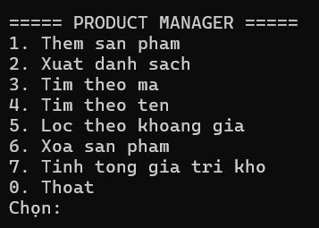
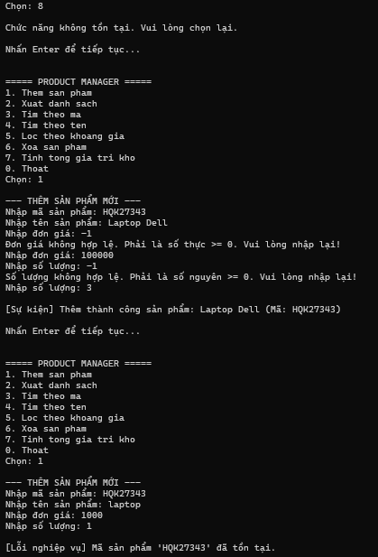
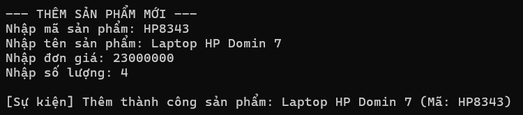
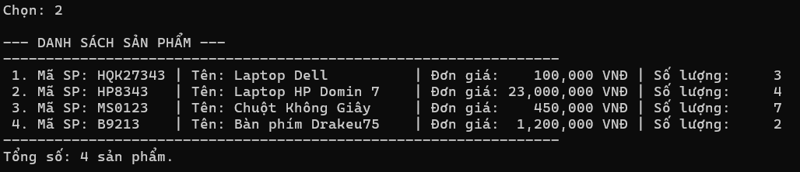
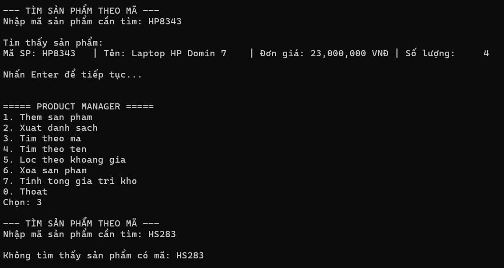
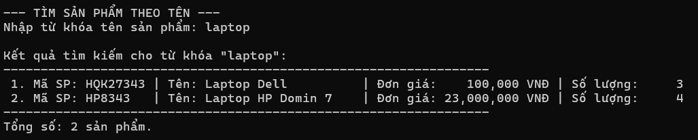
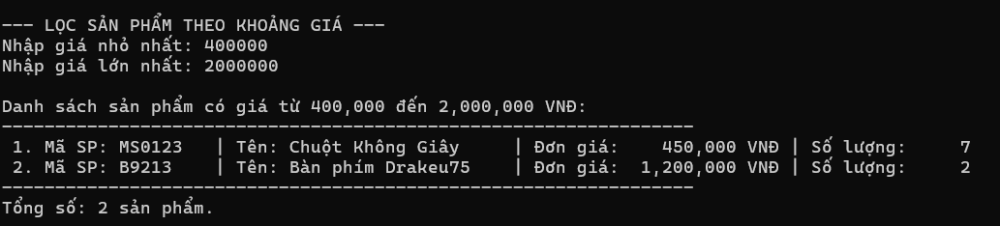
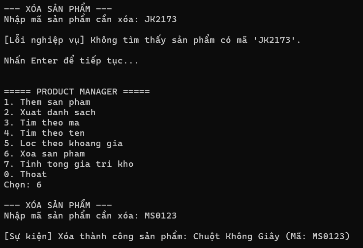
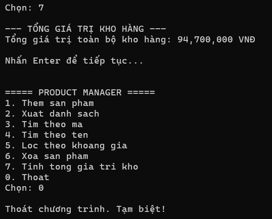

# BÁO CÁO KẾT QUẢ THỰC HÀNH LAB 04
**Học phần:** COMP1019 - Lập trình trên Windows  
**Sinh viên thực hiện:** Đặng Hoàng Bảo Huy | **MSSV:** 51.01.104.033 | **Lớp:** 51.01.CNTT.C  

---

## 1. Giao diện Menu điều khiển ban đầu

- **Mô tả:** Khi khởi động ứng dụng Console, chương trình hiển thị menu `PRODUCT MANAGER` gồm 8 lựa chọn (từ 0 đến 7) cùng dấu nhắc người dùng nhập lệnh.
- **Tính năng:**
  - Thiết lập bảng mã UTF-8 hỗ trợ nhập/xuất tiếng Việt (`Console.OutputEncoding = Encoding.UTF8`).
  - Khởi tạo đối tượng `ProductService`, generic `Repository<Product>` và đăng ký nhận sự kiện qua Action delegate (`OnProductAdded`, `OnProductRemoved`).
  - Sử dụng vòng lặp `do-while` duy trì chương trình cho đến khi người dùng nhập `0` để thoát.

---

## 2. Kiểm tra dữ liệu đầu vào & Bắt lỗi ngoại lệ (Validation & Exceptions)

- **Mô tả:** Kiểm soát toàn bộ luồng dữ liệu vào và xử lý lỗi bằng các Exception chuyên biệt kết hợp `try-catch`, ngăn chặn hoàn toàn lỗi văng chương trình (*runtime crash*):
  - **Lỗi chọn chức năng:** Bắt buộc nhập số nguyên từ `0` đến `7`. Nhập ký tự chữ hoặc số ngoài khoảng sẽ nhận cảnh báo *"Lựa chọn không hợp lệ. Vui lòng nhập số từ 0 đến 7."*.
  - **Lỗi chuỗi để trống:** Mã sản phẩm, tên sản phẩm và từ khóa tìm kiếm nếu để trống hoặc chỉ chứa khoảng trắng sẽ bị yêu cầu nhập lại ngay lập tức.
  - **Lỗi đơn giá và số lượng:** Số lượng phải là số nguyên $\ge 0$, đơn giá phải là số thực $\ge 0$ (hỗ trợ nhập cả dấu phẩy `,` và dấu chấm `.`). Nếu truyền số âm, model `Product` chủ động ném `ArgumentException`.
  - **Lỗi trùng mã sản phẩm:** Khi thêm sản phẩm có mã đã tồn tại, `ProductService` ném ngoại lệ tự tạo `DuplicateProductException` và chương trình bắt lỗi hiển thị: `[Lỗi nghiệp vụ] Mã sản phẩm '...' đã tồn tại.`.

---

## 3. Chức năng Thêm sản phẩm & Bắn sự kiện (Chức năng 1)

- **Mô tả:**
  - Nhập đầy đủ thông tin: Mã sản phẩm, Tên sản phẩm, Đơn giá và Số lượng.
  - Khởi tạo đối tượng `Product` (triển khai interface `IEntity`) và đưa vào generic `Repository<Product>` thông qua `service.AddProduct(p)`.
  - Khi thêm thành công, sự kiện `OnProductAdded` tự động kích hoạt Action delegate thông báo: `[Sự kiện] Thêm thành công sản phẩm: {p.TenSP} (Mã: {p.MaSP})`.

---

## 4. Chức năng Xuất danh sách sản phẩm (Chức năng 2)

- **Mô tả:**
  - Gọi phương thức `service.GetAll()` để lấy toàn bộ danh sách sản phẩm từ generic `Repository<Product>`.
  - Hiển thị danh sách dạng bảng căn lề rõ ràng: STT, Mã SP, Tên sản phẩm, Đơn giá (định dạng phân cách hàng nghìn `VNĐ`) và Số lượng tồn kho.
  - Thống kê tổng số lượng sản phẩm hiện có. Nếu danh sách chưa có dữ liệu, hiển thị thông báo *"Danh sách trống."*.

---

## 5. Chức năng Tìm kiếm sản phẩm theo mã (Chức năng 3)

- **Mô tả:**
  - Người dùng nhập mã sản phẩm cần tra cứu.
  - Sử dụng phương thức generic `FindById` của `Repository<Product>` (ràng buộc `where T : IEntity`), so sánh mã không phân biệt chữ hoa/thường (`OrdinalIgnoreCase`).
  - **Nếu tìm thấy:** In chi tiết thông tin sản phẩm tìm được.
  - **Nếu không tìm thấy:** Hiển thị thông báo *"Không tìm thấy sản phẩm có mã: {maSP}"*.

---

## 6. Chức năng Tìm kiếm sản phẩm theo tên (Chức năng 4)

- **Mô tả:**
  - Người dùng nhập từ khóa tên sản phẩm cần tìm.
  - Ứng dụng tham số `Func<Product, bool>` truyền vào hàm generic `Repository.Find()`: biểu thức lambda `p => p.TenSP.Contains(keyword, StringComparison.OrdinalIgnoreCase)`.
  - Trích xuất và in danh sách tất cả các sản phẩm có tên chứa từ khóa tìm kiếm.

---

## 7. Chức năng Lọc sản phẩm theo khoảng giá (Chức năng 5)

- **Mô tả:**
  - Nhập khoảng giá cần lọc gồm giá nhỏ nhất (`min`) và giá lớn nhất (`max`), có kiểm tra hợp lệ $max \ge min$.
  - Sử dụng `Func<Product, bool>` qua biểu thức lambda `p => p.Price >= minPrice && p.Price <= maxPrice`.
  - Hiển thị danh sách các sản phẩm có mức giá nằm trong khoảng chỉ định kèm tiêu đề khoảng giá.

---

## 8. Chức năng Xóa sản phẩm & Bắt lỗi không tồn tại (Chức năng 6)

- **Mô tả:**
  - Nhập mã sản phẩm cần xóa khỏi hệ thống.
  - **Nếu mã không tồn tại:** `ProductService` ném ngoại lệ tự tạo `ProductNotFoundException`, chương trình bắt lỗi và thông báo: `[Lỗi nghiệp vụ] Không tìm thấy sản phẩm có mã '...'`.
  - **Nếu mã tồn tại:** Xóa sản phẩm khỏi `Repository<Product>` và kích hoạt sự kiện `OnProductRemoved`, in thông báo xác nhận: `[Sự kiện] Xóa thành công sản phẩm: {p.TenSP} (Mã: {p.MaSP})`.

---

## 9. Chức năng Tính tổng giá trị kho & Thoát chương trình (Chức năng 7 & 0)

- **Mô tả:**
  - **Chức năng 7 (Tổng giá trị kho):** Gọi `service.CalculateTotalValue()` duyệt qua toàn bộ sản phẩm trong `Repository`, tính tổng tích lũy $\sum (\text{Đơn giá} \times \text{Số lượng})$ và in ra tổng giá trị kho hàng định dạng tiền tệ VNĐ (`N0`).
  - **Chức năng 0 (Thoát chương trình):** Khi nhập phím `0`, điều kiện lặp dừng lại, chương trình in lời chào *"Thoát chương trình. Tạm biệt!"* và kết thúc ứng dụng an toàn.
