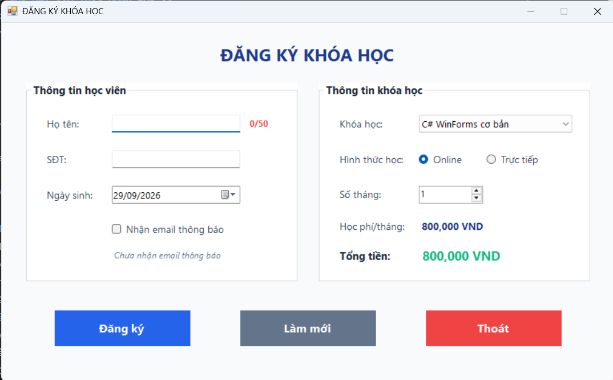
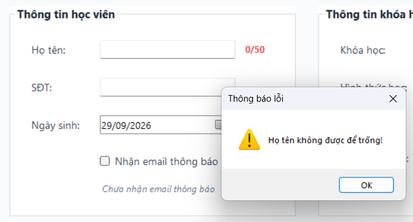
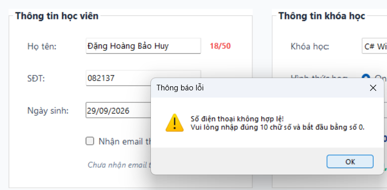
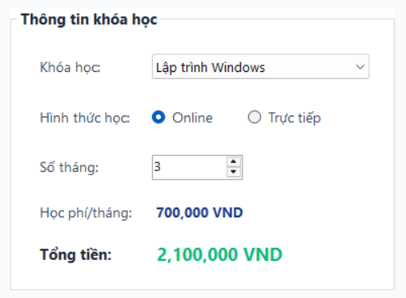
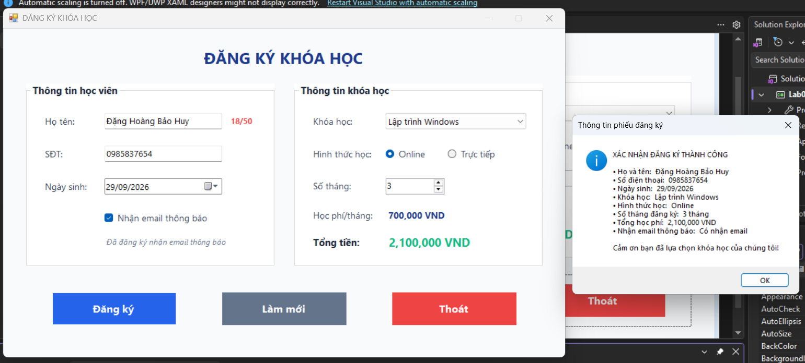
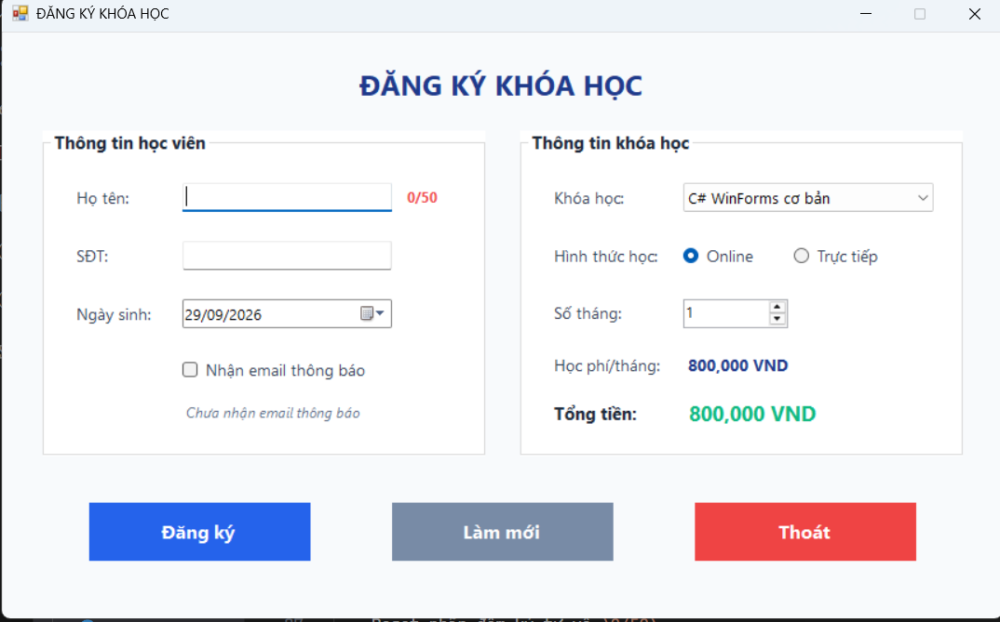
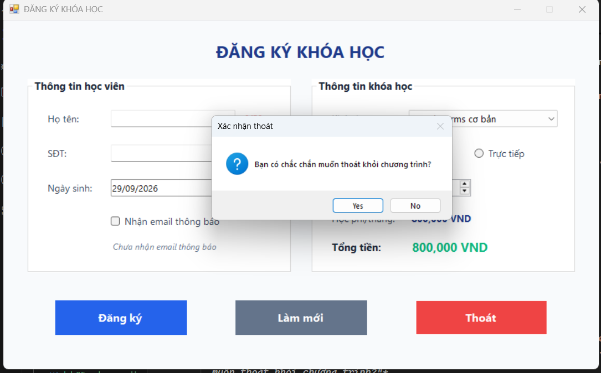
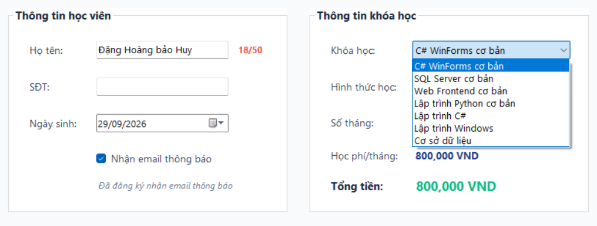

# BÁO CÁO KẾT QUẢ THỰC HÀNH LAB 05
**Học phần:** COMP1019 - Lập trình trên Windows  
**Sinh viên thực hiện:** Đặng Hoàng Bảo Huy | **MSSV:** 51.01.104.033 | **Lớp:** 51.01.CNTT.C  

---

## 1. Giao diện ứng dụng khi khởi tạo (Form Load)

- **Mô tả:** Khi ứng dụng **CourseRegistrationApp** khởi chạy, sự kiện `Form1_Load` được kích hoạt và khởi tạo trạng thái ban đầu chuẩn mực cho toàn bộ hệ thống giao diện:
- **Tính năng & Thiết lập mặc định:**
  - Tiêu đề Form được đặt chuẩn: `ĐĂNG KÝ KHÓA HỌC`, cố định kích thước (`FormBorderStyle = FixedSingle`, `MaximizeBox = false`) và xuất hiện ngay giữa màn hình (`StartPosition = CenterScreen`).
  - Giao diện được tổ chức khoa học với 2 nhóm chính sử dụng `GroupBox`: **Thông tin học viên** và **Thông tin khóa học**, cùng thanh nút lệnh điều khiển bên dưới.
  - Nạp danh mục các khóa học vào `cboKhoaHoc` kèm bảng đơn giá và tự động chọn khóa học đầu tiên (`SelectedIndex = 0`).
  - Chọn mặc định hình thức học **Online** (`radOnline.Checked = true`).
  - Giới hạn số tháng đăng ký trong `numSoThang`: Tối thiểu là `1`, tối đa là `12`, giá trị khởi tạo là `1`.
  - Giá trị ngày sinh trên `dtpNgaySinh` mặc định là ngày hiện tại (`DateTime.Today`), định dạng hiển thị `dd/MM/yyyy`.
  - Trạng thái nhận email thông báo mặc định là bỏ chọn (`chkNhanEmail.Checked = false`), nhãn trạng thái hiển thị *"Chưa nhận email thông báo"*.
  - Tự động tính và hiển thị ngay đơn giá tháng cùng tổng học phí khởi điểm ban đầu.
  - Đưa con trỏ soạn thảo (`Focus`) về ô Họ tên (`txtHoTen`) để người dùng sẵn sàng nhập liệu.

---

## 2. Kiểm tra dữ liệu đầu vào & Bắt lỗi hợp lệ (Validation)

| Lỗi để trống họ tên | Lỗi số điện thoại không hợp lệ |
| :---: | :---: |
|  |  |

- **Mô tả:** Hàm `KiemTraDuLieu()` kiểm soát toàn bộ tính toàn vẹn của dữ liệu trước khi xử lý đăng ký, cảnh báo rõ ràng bằng `MessageBox` với biểu tượng cảnh báo `MessageBoxIcon.Warning`:
  - **Lỗi họ tên để trống:** Kiểm tra `string.IsNullOrWhiteSpace(txtHoTen.Text)`. Nếu trống hoặc chỉ chứa khoảng trắng, hiển thị thông báo *"Họ tên không được để trống!"* và đưa con trỏ về `txtHoTen.Focus()`.
  - **Lỗi số điện thoại không hợp lệ:** Kiểm tra nghiêm ngặt thông qua hàm `SoDienThoaiHopLe()`:
    - Bắt buộc phải có đúng **10 chữ số** (`Length == 10`).
    - Bắt buộc phải bắt đầu bằng **chữ số 0** (`StartsWith("0")`).
    - Toàn bộ các ký tự phải là chữ số (`char.IsDigit`).
    - Nếu vi phạm, hiển thị thông báo: *"Số điện thoại không hợp lệ! Vui lòng nhập đúng 10 chữ số và bắt đầu bằng số 0."* và đưa con trỏ về `txtSoDienThoai.Focus()`.

---

## 3. Chức năng Tự động tính học phí tức thì (Real-time Fee Calculation)

- **Mô tả:** Hệ thống tự động cập nhật học phí theo thời gian thực mỗi khi có sự thay đổi từ người dùng thông qua hàm dùng chung `CapNhatHocPhi()`:
  - **Sự kiện lắng nghe:**
    - Thay đổi khóa học: `cboKhoaHoc.SelectedIndexChanged`.
    - Tăng/giảm số tháng học: `numSoThang.ValueChanged`.
    - Thay đổi hình thức học Online / Trực tiếp: `radOnline.CheckedChanged`, `radOffline.CheckedChanged`.
  - **Bảng dữ liệu khóa học:**
    - C# WinForms cơ bản: `800.000 VND / tháng`
    - SQL Server cơ bản: `700.000 VND / tháng`
    - Web Frontend cơ bản: `750.000 VND / tháng`
    - Lập trình Python cơ bản: `650.000 VND / tháng`
  - **Công thức tính:**
    $$\text{Đơn giá tháng} = \text{Học phí môn} + \text{Phụ phí hình thức (Trực tiếp: +100.000 VND)}$$
    $$\text{Tổng học phí} = \text{Đơn giá tháng} \times \text{Số tháng đăng ký}$$
  - Kết quả được định dạng phân cách hàng nghìn rõ ràng (`#,##0 VND`) và hiển thị trực tiếp lên nhãn `lblDonGia` cùng `lblTongTien`.

---

## 4. Chức năng Đăng ký khóa học & Xuất phiếu xác nhận

- **Mô tả:** Khi người dùng nhấn nút **Đăng ký** (`btnDangKy`):
  - Chương trình gọi kiểm tra tính hợp lệ qua `KiemTraDuLieu()`.
  - Nếu dữ liệu hợp lệ, hệ thống thu thập toàn bộ 8 trường thông tin đăng ký:
    1. Họ và tên học viên.
    2. Số điện thoại liên hệ.
    3. Ngày tháng năm sinh (định dạng `dd/MM/yyyy`).
    4. Tên khóa học đã chọn.
    5. Hình thức học (`Online` hoặc `Trực tiếp`).
    6. Số tháng đăng ký học.
    7. Tổng tiền học phí cần thanh toán.
    8. Tình trạng đăng ký nhận email thông báo (`Có nhận email` hoặc `Không nhận email`).
  - Xuất hộp thoại thông báo `MessageBox` với biểu tượng `MessageBoxIcon.Information`, trình bày bố cục gọn gàng, rõ ràng và trang nhã xác nhận đăng ký thành công.

---

## 5. Chức năng Làm mới dữ liệu (Reset Form)

- **Mô tả:** Khi nhấn nút **Làm mới** (`btnLamMoi`), toàn bộ trạng thái nhập liệu trên giao diện được khôi phục về trạng thái sạch sẽ ban đầu:
  - Xóa trắng chuỗi văn bản trong `txtHoTen` và `txtSoDienThoai`.
  - Reset nhãn đếm ký tự về `0/50`.
  - Trả ngày sinh về ngày hiện tại (`DateTime.Today`).
  - Bỏ chọn checkbox nhận email (`chkNhanEmail.Checked = false`), cập nhật nhãn thông báo thành *"Chưa nhận email thông báo"*.
  - Khôi phục lựa chọn khóa học về môn đầu tiên (`cboKhoaHoc.SelectedIndex = 0`).
  - Khôi phục hình thức học về mặc định **Online** (`radOnline.Checked = true`).
  - Thiết lập lại số tháng học về `1`.
  - Tính toán và cập nhật lại học phí hiển thị theo giá trị mặc định.
  - Tự động di chuyển con trỏ soạn thảo về ô Họ tên (`txtHoTen.Focus()`) để bắt đầu lượt nhập mới.

---

## 6. Chức năng Xác nhận thoát ứng dụng

- **Mô tả:** Khi người dùng click nút **Thoát** (`btnThoat`):
  - Chương trình không đóng đột ngột mà bật hộp thoại xác nhận `MessageBox.Show` với hai nút lựa chọn `Yes / No` cùng biểu tượng câu hỏi `MessageBoxIcon.Question`: *"Bạn có chắc chắn muốn thoát khỏi chương trình?"*.
  - **Nếu chọn Yes:** Chương trình gọi `this.Close()` để giải phóng tài nguyên và kết thúc ứng dụng một cách an toàn.
  - **Nếu chọn No:** Hộp thoại đóng lại và người dùng tiếp tục thao tác bình thường trên form mà không bị mất dữ liệu đang nhập.

---

## 7. Các tiện ích nâng cao trải nghiệm người dùng (UX Enhancements)

- **Đếm số ký tự Họ tên theo thời gian thực:**
  - Sự kiện `txtHoTen_TextChanged` theo dõi độ dài chuỗi nhập, hiển thị chỉ số trực quan `lblDemKyTu` dạng `{Length}/50` với màu sắc cảnh báo đỏ nổi bật, giúp học viên dễ dàng kiểm soát độ dài hợp lệ.
- **Phản hồi trạng thái CheckBox tức thì:**
  - Sự kiện `chkNhanEmail_CheckedChanged` thay đổi nội dung nhãn phụ `lblTrangThaiEmail` ngay khi tick chọn (*"Đã đăng ký nhận email thông báo"*) hoặc bỏ tick (*"Chưa nhận email thông báo"*).
- **Thứ tự phím Tab (Tab Order) liền mạch:**
  - Thiết lập `TabIndex` từ trên xuống dưới, từ trái sang phải: `txtHoTen` $\rightarrow$ `txtSoDienThoai` $\rightarrow$ `dtpNgaySinh` $\rightarrow$ `chkNhanEmail` $\rightarrow$ `cboKhoaHoc` $\rightarrow$ `radOnline` $\rightarrow$ `radOffline` $\rightarrow$ `numSoThang` $\rightarrow$ `btnDangKy` $\rightarrow$ `btnLamMoi` $\rightarrow$ `btnThoat`. Người dùng có thể hoàn thành toàn bộ thao tác đăng ký chỉ bằng bàn phím.
- **Thiết kế giao diện hiện đại (Modern UI):**
  - Đồng bộ font chữ toàn hệ thống bằng **Segoe UI** sắc nét.
  - Phối màu nhã nhặn, chuyên nghiệp theo phong cách phẳng (Flat Design), loại bỏ các đường viền 3D thô ráp.
