# BÁO CÁO KẾT QUẢ THỰC HÀNH LAB 06
**Học phần:** COMP1019 - Lập trình trên Windows  
**Đề tài:** Xây dựng ứng dụng Quản lý sản phẩm (ProductManager)  
**Sinh viên thực hiện:** Đặng Hoàng Bảo Huy | **MSSV:** 51.01.104.033 | **Lớp:** 51.01.CNTT.C  

---

## 1. Giao diện ứng dụng khi khởi tạo (Form Load)

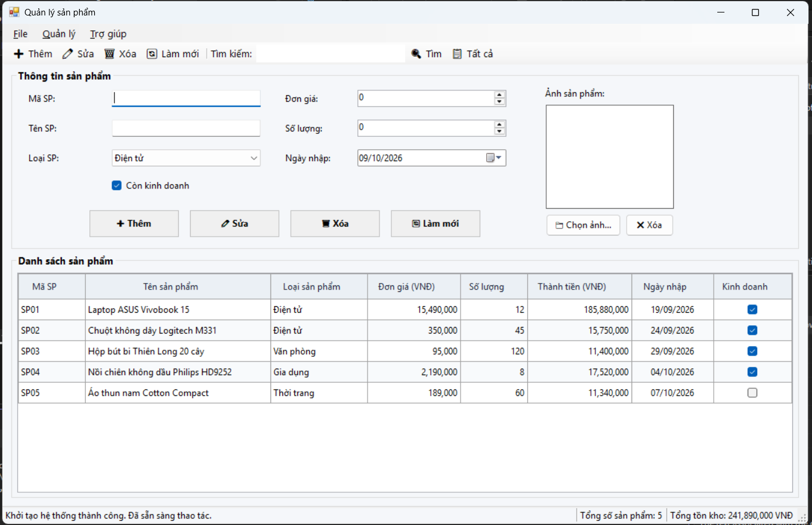

- **Mô tả:** Khi ứng dụng **ProductManager** khởi chạy, sự kiện `FrmProduct_Load` được kích hoạt và khởi tạo trạng thái ban đầu chuẩn mực cho toàn bộ hệ thống giao diện:
- **Tính năng & Thiết lập mặc định:**
  - Tiêu đề Form được đặt chuẩn: `Quản lý sản phẩm`, xuất hiện ngay giữa màn hình (`StartPosition = CenterScreen`).
  - Hệ thống thanh điều hướng toàn diện:
    - **MenuStrip:** Tổ chức khoa học gồm 3 nhóm *File* (Xuất danh sách .txt, Thoát), *Quản lý* (Thêm, Sửa, Xóa, Làm mới) và *Trợ giúp* (Giới thiệu).
    - **ToolStrip:** Các nút lệnh thao tác nhanh có biểu tượng trực quan (Thêm, Sửa, Xóa, Làm mới) cùng cụm tìm kiếm tích hợp (`ToolStripTextBox`, nút `Tìm`, nút `Tất cả`).
    - **StatusStrip:** 3 nhãn thông tin chuyên nghiệp ở chân trang gồm: Thông báo hành động (`lblStatus`), Tổng số lượng sản phẩm (`lblCount`) và Tổng giá trị tồn kho (`lblTongGiaTri`).
  - **GroupBox "Thông tin sản phẩm":** Sắp xếp trực quan các trường nhập liệu (`txtMaSP`, `txtTenSP`, `cboLoaiSP`, `numDonGia`, `numSoLuong`, `dtpNgayNhap`, `chkConKinhDoanh`, `picAnh`, `btnChonAnh`, `btnXoaAnh`).
  - Nạp danh mục 4 loại sản phẩm chuẩn vào `cboLoaiSP` (*Điện tử*, *Văn phòng*, *Gia dụng*, *Thời trang*) và mặc định chọn loại đầu tiên (`SelectedIndex = 0`).
  - Nạp sẵn 5 sản phẩm mẫu phong phú đại diện các ngành hàng thông qua hàm `SeedSampleData()`.
  - Thiết lập liên kết dữ liệu hai chiều thông qua `BindingSource` và `BindingList<Product>`.
  - Tự động gọi `ClearInput()` đưa form về trạng thái sẵn sàng và con trỏ soạn thảo đặt tại ô Mã sản phẩm (`txtMaSP.Focus()`).

---

## 2. Kiểm tra dữ liệu đầu vào & Bắt lỗi hợp lệ (Validation)

| Báo lỗi để trống & Trùng mã sản phẩm | Báo lỗi Đơn giá & Ngày nhập không hợp lệ |
| :---: | :---: |
| 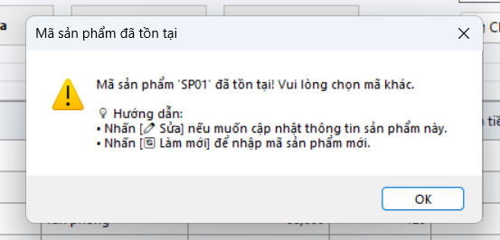 | 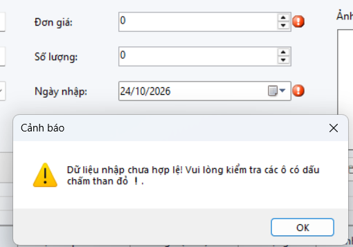 |

- **Mô tả:** Hàm `ValidateInput(bool isEdit)` kiểm soát toàn bộ tính toàn vẹn của dữ liệu trước khi thực hiện thêm hoặc sửa sản phẩm, kết hợp cảnh báo bằng `ErrorProvider` (icon chấm than đỏ ❗) và hộp thoại `MessageBox` trực quan:
  - **Mã sản phẩm (`txtMaSP`):** Không được để trống. Khi ở chế độ thêm mới (`!isEdit`), kiểm tra trùng lặp mã sản phẩm trong danh sách không phân biệt hoa thường (`StringComparison.OrdinalIgnoreCase`).
  - **Tên sản phẩm (`txtTenSP`):** Bắt buộc nhập, không được để trống hoặc chỉ chứa khoảng trắng.
  - **Loại sản phẩm (`cboLoaiSP`):** Bắt buộc phải chọn một mục hợp lệ trong danh mục.
  - **Đơn giá (`numDonGia`):** Bắt buộc phải lớn hơn `0` VNĐ.
  - **Số lượng (`numSoLuong`):** Bắt buộc phải lớn hơn hoặc bằng `0`.
  - **Ngày nhập (`dtpNgayNhap`):** Không được lớn hơn ngày hiện tại (`DateTime.Today`).
  - Khi dữ liệu vi phạm, `ErrorProvider` gắn cờ báo lỗi ngay cạnh control tương ứng, thanh trạng thái hiển thị thông báo nhắc nhở và bật `MessageBoxIcon.Warning`.

---

## 3. Quản lý danh sách với DataGridView, BindingList & BindingSource

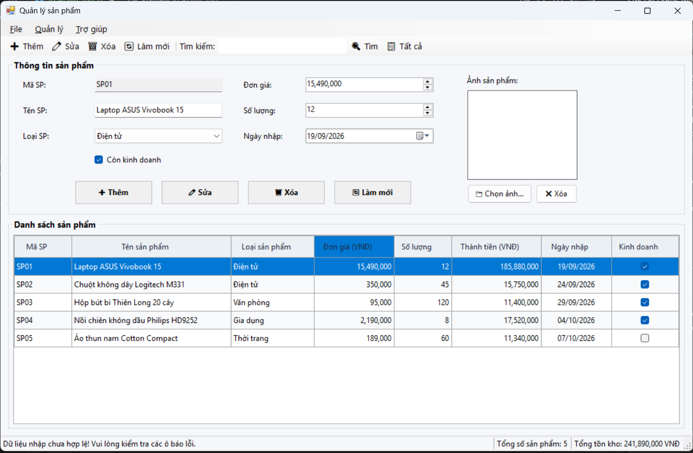

- **Mô tả:** Ứng dụng tổ chức kiến trúc dữ liệu chuẩn mực, tách biệt giữa mô hình đối tượng và hiển thị giao diện:
  - **Lớp mô hình `Product`:** Đóng gói đầy đủ các trường thông tin: `MaSP`, `TenSP`, `LoaiSP`, `DonGia`, `SoLuong`, `NgayNhap`, `ConKinhDoanh`, `DuongDanAnh`, cùng thuộc tính dẫn xuất tự động `ThanhTien = DonGia * SoLuong`.
  - **Cơ chế liên kết `BindingSource` & `BindingList<Product>`:** Mọi thay đổi dữ liệu trên danh sách gốc lập tức được phản ánh tự động lên `DataGridView` mà không cần nạp lại thủ công.
  - **Thiết lập DataGridView (`dgvProducts`) chuẩn kỹ thuật đề bài:**
    - `ReadOnly = true`: Chống chỉnh sửa trực tiếp trên ô lưới.
    - `SelectionMode = FullRowSelect`: Chọn nguyên dòng dữ liệu khi click chuột.
    - `MultiSelect = false`: Chỉ cho phép chọn duy nhất 1 dòng tại một thời điểm.
    - `AlternatingRowsDefaultCellStyle`: Tô màu dòng so le dịu mắt, tăng khả năng quan sát.
    - Căn lề số học chuẩn: Đơn giá, số lượng, thành tiền căn phải; Ngày nhập căn giữa; Mã, tên, loại căn trái.
    - Định dạng tiền tệ phân cách hàng nghìn rõ ràng (`#,##0 VNĐ`) và định dạng ngày tháng `dd/MM/yyyy`.

---

## 4. Các chức năng CRUD (Thêm, Sửa, Xóa sản phẩm an toàn)

| Thêm mới sản phẩm thành công | Xác nhận trước khi xóa sản phẩm |
| :---: | :---: |
| 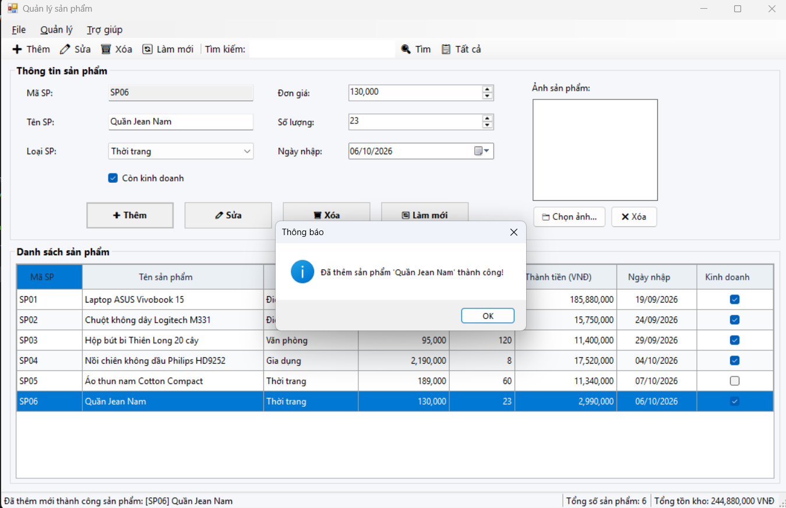 | 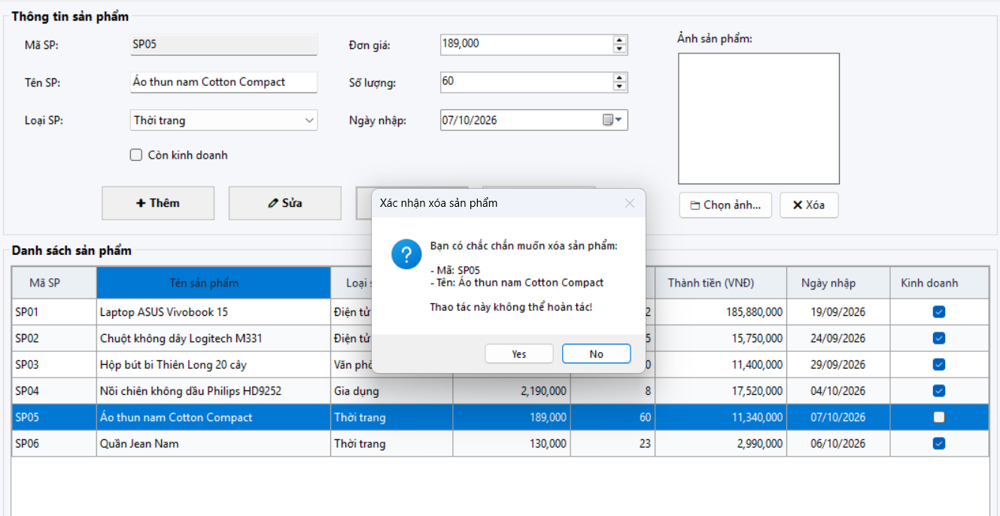 |

- **Mô tả:** Bộ xử lý CRUD được xây dựng an toàn, chặt chẽ, loại bỏ hoàn toàn các lỗi thao tác ngoài ý muốn:
  - **Thêm sản phẩm (`btnThem_Click`):**
    - Kiểm tra dữ liệu qua `ValidateInput(isEdit: false)` để đảm bảo mã chưa từng tồn tại.
    - Khởi tạo đối tượng `Product`, thêm vào danh sách và tự động đồng bộ hiển thị bằng `LamMoiHienThi(newProduct)`.
    - Thông báo thành công và xóa trắng vùng nhập để sẵn sàng cho lượt nhập tiếp theo.
  - **Sửa sản phẩm (`btnSua_Click`):**
    - Sử dụng hàm kiểm tra chặt chẽ `GetSelectedProduct()`: Nếu người dùng chưa chọn dòng nào trên bảng (`SelectedRows.Count == 0`), chương trình hiển thị cảnh báo và dừng thao tác, tuyệt đối không ghi đè dữ liệu lên dòng khác.
    - Kiểm tra tính hợp lệ qua `ValidateInput(isEdit: true)`.
    - Cập nhật thông tin đối tượng, đồng bộ lại DataGridView và cập nhật StatusStrip.
  - **Xóa sản phẩm (`btnXoa_Click`):**
    - Kiểm tra dòng được chọn bằng `GetSelectedProduct()`.
    - Bật hộp thoại xác nhận `MessageBox.Show` hai nút `Yes / No` (`MessageBoxIcon.Question`, `MessageBoxDefaultButton.Button2`) hiển thị rõ mã và tên sản phẩm sắp xóa.
    - Chỉ xóa khi người dùng chọn `Yes`, sau đó đồng bộ lại danh sách hiển thị và xóa trắng vùng nhập liệu.

---

## 5. Tìm kiếm sản phẩm theo thời gian thực (Search Filter)

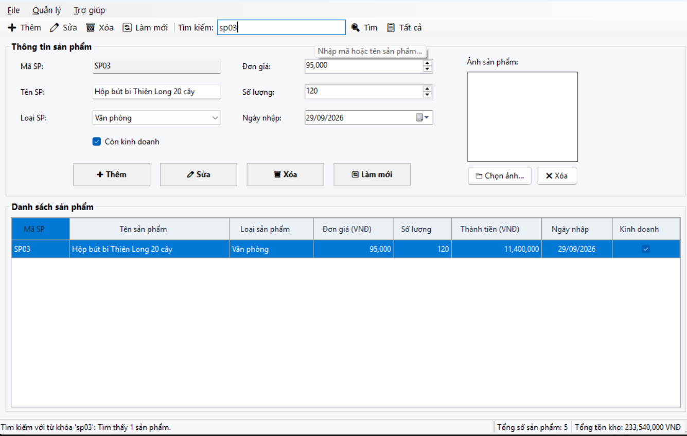

- **Mô tả:** Hệ thống hỗ trợ tra cứu sản phẩm tức thì và thông minh:
  - **Tiêu chí tìm kiếm:** Tra cứu đồng thời theo **Mã sản phẩm**, **Tên sản phẩm** hoặc **Loại sản phẩm**, không phân biệt chữ hoa hay chữ thường (`StringComparison.OrdinalIgnoreCase`).
  - **Phương thức kích hoạt:** Nhập từ khóa rồi nhấn nút **Tìm** hoặc nhấn phím `Enter` ngay trong ô tìm kiếm.
  - **Đồng bộ dữ liệu hai chiều nâng cao (`LamMoiHienThi`):**
    - Khi đang trong chế độ lọc kết quả, các thao tác Thêm, Sửa, Xóa đều tự động tái áp dụng bộ lọc ngay lập tức.
    - Nếu xóa sản phẩm đang tìm, sản phẩm sẽ biến mất ngay khỏi bảng hiển thị.
    - Nếu thêm sản phẩm mới khớp từ khóa, sản phẩm sẽ xuất hiện ngay trên bảng mà không cần tìm kiếm lại.
  - **Hủy tìm kiếm:** Nhấn nút **Tất cả** (`btnToolTatCa`) hoặc nút **Làm mới** để xóa từ khóa và hiển thị lại toàn bộ sản phẩm.

---

## 6. Làm mới biểu mẫu & Khắc phục xung đột sự kiện (Reset Form)

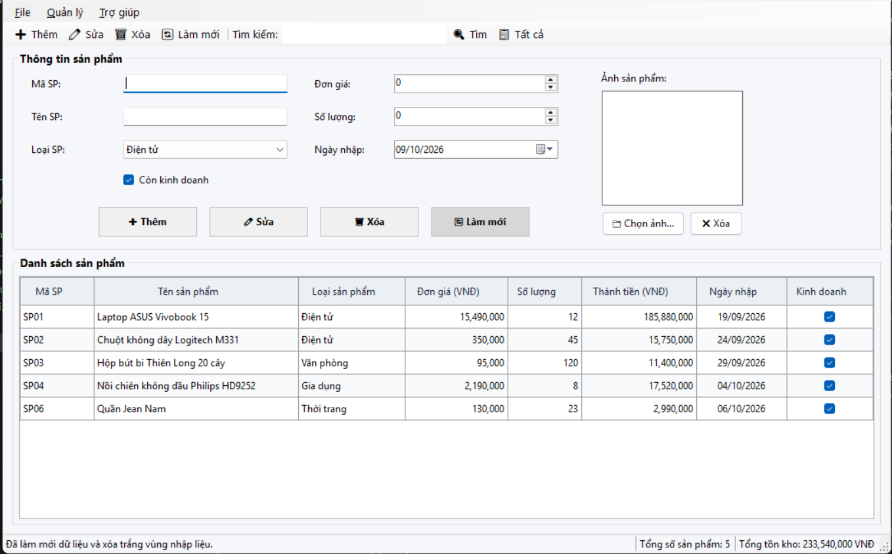

- **Mô tả:** Khi người dùng nhấn nút **Làm mới** (`btnLamMoi`, menu hoặc phím tắt `F5`):
  - Khôi phục trạng thái nhập liệu về mặc định: Xóa trắng Mã SP, Tên SP, đường dẫn ảnh, xóa ảnh hiển thị.
  - Mở khóa ô mã sản phẩm (`txtMaSP.ReadOnly = false`) để sẵn sàng thêm sản phẩm mới.
  - Đặt lại Đơn giá về `0`, Số lượng về `0`, Ngày nhập về ngày hiện tại (`DateTime.Today`), trạng thái còn kinh doanh là `true`.
  - Xóa toàn bộ cờ cảnh báo lỗi của `ErrorProvider`.
  - Hủy bộ lọc tìm kiếm và khôi phục hiển thị toàn bộ danh sách sản phẩm.
  - Hủy chọn trên DataGridView (`dgvProducts.ClearSelection()`).
  - Đưa con trỏ soạn thảo về ô Mã sản phẩm (`txtMaSP.Focus()`).
- **Giải pháp kỹ thuật chuyên sâu:** Sử dụng biến cờ `_isClearingInput` bao bọc trong khối `try ... finally` để triệt tiêu hiện tượng xung đột sự kiện vòng lặp (Event Cascade Loop) giữa `ClearSelection()` và `SelectionChanged`, đảm bảo không bao giờ bị nạp ngược dữ liệu cũ lên form sau khi nhấn Làm mới.

---

## 7. Thao tác tiện ích: ContextMenuStrip, Chọn ảnh & Phím tắt

| Menu ngữ cảnh (Chuột phải) & Xem chi tiết | Chọn ảnh sản phẩm bằng OpenFileDialog |
| :---: | :---: |
| 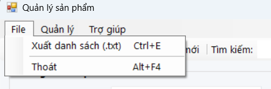 | 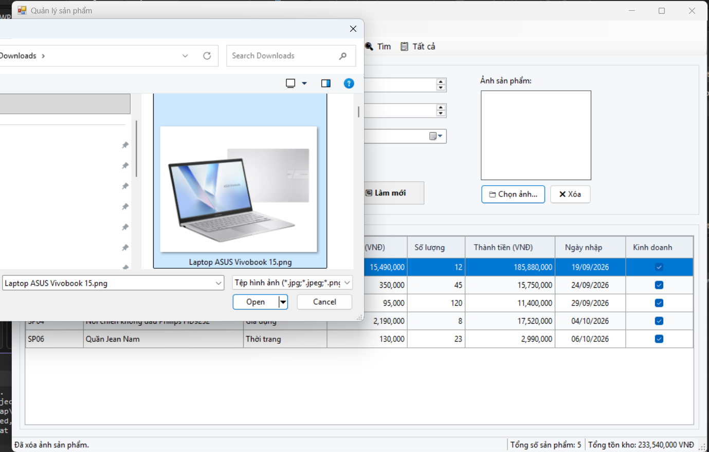 |

- **ContextMenuStrip trên DataGridView:**
  - Nhấp chuột phải vào bất kỳ dòng nào sẽ hiển thị menu ngữ cảnh gồm: *Sửa*, *Xóa*, và *Xem chi tiết*.
  - Bắt sự kiện `CellMouseDown` chuyển vùng chọn chính xác ngay tại vị trí click chuột phải, khắc phục hoàn toàn lỗi thao tác nhầm trên dòng đã chọn trước đó.
  - Lệnh **Xem chi tiết** mở hộp thoại tổng hợp toàn bộ thông số kỹ thuật của sản phẩm một cách trang nhã.
- **Xử lý hình ảnh với OpenFileDialog:**
  - Hộp thoại chọn ảnh có bộ lọc định dạng thông dụng (`*.jpg`, `*.jpeg`, `*.png`, `*.bmp`).
  - Nạp ảnh an toàn bằng `FileStream` để tránh việc `Image.FromFile` khóa tệp tin trên ổ cứng.
  - Nút *Xóa ảnh* giúp làm sạch ảnh và giải phóng bộ nhớ (`Dispose`).
- **Hệ thống phím tắt nhanh:**
  - `Ctrl + F`: Nhảy nhanh con trỏ đến ô tìm kiếm.
  - Phím tắt tiêu chuẩn trên Menu: `Ctrl + N` (Thêm), `Ctrl + S` (Sửa), `Delete` (Xóa), `F5` (Làm mới), `Ctrl + P` (Xuất file), `Alt + F4` (Thoát).

---

## 8. Chức năng mở rộng: Xuất báo cáo tệp .txt & Thống kê tồn kho

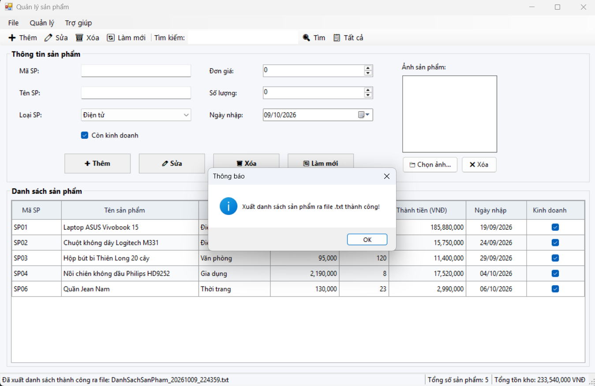

- **Xuất danh sách sản phẩm ra tệp văn bản .txt:**
  - Tích hợp `SaveFileDialog` với tên file tự động định dạng theo ngày giờ: `DanhSachSanPham_yyyyMMdd_HHmmss.txt`.
  - Trình bày dạng bảng báo cáo văn bản chuyên nghiệp: Có phần đầu trang, ngày giờ kết xuất, tổng số lượng mặt hàng, tổng giá trị kho hàng, các cột căn lề thẳng hàng đẹp mắt và hỗ trợ mã hóa tiếng Việt UTF-8.
- **Thống kê tổng giá trị tồn kho theo thời gian thực:**
  - Tự động tính toán tổng giá trị tồn kho: $\sum (\text{Đơn giá} \times \text{Số lượng})$.
  - Cập nhật tức thời lên nhãn `lblTongGiaTri` trên thanh StatusStrip mỗi khi có biến động dữ liệu.

---

## 9. Các tiện ích nâng cao trải nghiệm người dùng (UX Enhancements)

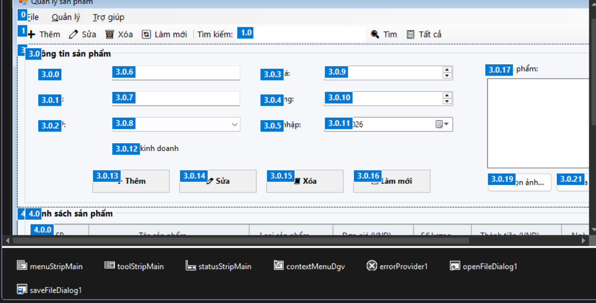

- **Thứ tự phím Tab (Tab Order) liền mạch:**
  - Thiết lập `TabIndex` chuẩn mực từ trên xuống dưới, từ trái sang phải: `txtMaSP` $\rightarrow$ `txtTenSP` $\rightarrow$ `cboLoaiSP` $\rightarrow$ `numDonGia` $\rightarrow$ `numSoLuong` $\rightarrow$ `dtpNgayNhap` $\rightarrow$ `chkConKinhDoanh` $\rightarrow$ `btnChonAnh` $\rightarrow$ `btnThem` $\rightarrow$ `btnSua` $\rightarrow$ `btnXoa` $\rightarrow$ `btnLamMoi`. Người dùng có thể hoàn thành toàn bộ thao tác chỉ bằng bàn phím.
- **Phản hồi trạng thái liên tục (StatusStrip):**
  - Mọi hành động thêm, sửa, xóa, tìm kiếm, xuất file đều phát thông báo văn bản rõ ràng tại `lblStatus`.
- **Thiết kế giao diện hiện đại (Modern UI):**
  - Đồng bộ font chữ toàn hệ thống bằng **Segoe UI** sắc nét.
  - Phối màu nhã nhặn, chuyên nghiệp theo phong cách phẳng (Flat Design), loại bỏ các viền 3D thô ráp.
  - DataGridView có tiêu đề nổi bật, chiều cao dòng rộng rãi (`28px`), hỗ trợ cuộn mượt mà.
